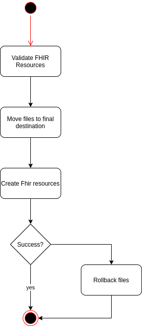

# clin-pipelines

Contains code for steps in clin pipelines.

## Import Files

Main-Class : [FileImport](src/main/scala/bio/ferlab/clin/etl/FileImport.scala)

This application import files metadata into FHIR. Input files are located in object store. Each batch of files contains :
- a metadata.json that contains the metadata of files and details about experiments
- a list of files that needs to be imported in clin. For each patient it is expected to have a CRAM + CRAI, a VCF + TBI, a qaulity report file (TGZ). Each file is listed in metatadata.json. If a file is missing, the application exits in error. 

The image below illustrate the process :



First, FHIR resources are built and validated against the server. Then, if resources are valid, files are moved to final destination. Initial filenames are replaced by uuid. Then, a bundle containing FHIR resources to create/update is sent to the server.If this operation fails, a rollback of files happens.    

## Export data from FHIR

Main-Class : [FhirExport](src/main/scala/bio/ferlab/clin/etl/FhirExport.scala)

This application is used to export data from fhir in NDJSON format and import this data in a bucket on an object store.

## Package
```
sbt assembly
docker build -t clin-pipelines .
```
## Configuration and environment variables

Configuration (Typesafe Config) is defined in file [application.conf](src/main/resources/application.conf).
Some attributes can be overridden by environment variables. For instance :
- `AWS_ACCESS_KEY` / `AWS_SECRET_KEY` : credentials for object store
- `AWS_ENDPOINT` : object store url
- `AWS_BUCKET_NAME`: Bucket where are input files
- `AWS_OUTPUT_BUCKET_NAME`: Bucket where copy output files
- `AWS_OUTPUT_PREFIX`: Prefix where to copy output files
- `KEYCLOAK_URL` : Keycloak authentication server url
- `KEYCLOAK_CLIENT_KEY` / `KEYCLOAK_CLIENT_SECRET` : Credentials for keycloak
- `KEYCLOAK_REALM` 
- `FHIR_URL` : Fhir Server URL
- `FERLOAD_URL` : Ferload instance server url. This is used to build DocumentReference urls.

## Local Development

### Running / debugging application in IDE
It's possible to run the application from any IDE. Just configure environment variables and run the desired main class.

### Running tests

There are 2 ways running tests : 
1. Running tests

Before running tests, required containers are automatically started if they are not already running. Containers are then automatically stopped and deleted.
For running test from sbt : 
```
sbt test
```
   
2. Starts containers aside, and then running tests
Because starting and initializing FHIR containers takes time, it's also possible to start containers aside and run test. To start a container you can start main application in one of those class :
   - [MinioServer](src/test/scala/bio/ferlab/clin/etl/fhir/testutils/MinioServer.scala) : Start a minio server
   - [FhirServer](src/test/scala/bio/ferlab/clin/etl/fhir/testutils/FhirServer.scala) : Start a fhir server
   - [WholeStack](src/test/scala/bio/ferlab/clin/etl/fhir/testutils/WholeStack.scala) : Start a fhir server + a minio server
 
After each test execution, data created by tests is cleaned up, but containers are kept up and running. 
